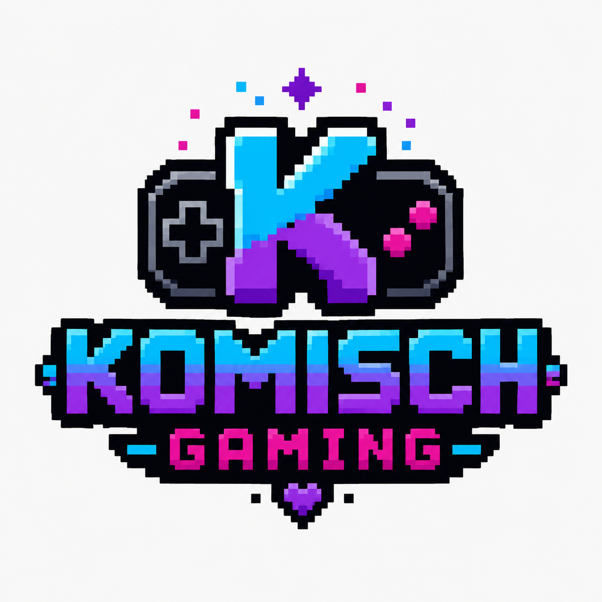

<div align="center">



# Komisch Gaming

**Quirky worlds. Tiny pixels. Big problems.**

Komisch Gaming is an independent game development repository focused on pixel-style games with strange worlds, memorable characters, and gameplay that rewards curiosity.

</div>

---

## About

This repository is the home of Komisch Gaming projects, prototypes, shared tools, and experiments.

The goal is simple: build polished pixel games that feel nostalgic without being trapped in the past. Expect unusual settings, dark humor, dangerous dungeons, questionable decisions, and more than a few pixels behaving badly.

## Projects

| Project | Status | Description |
|---|---|---|
| **Survive the Dungeon** | In development | A pixel-art dungeon survival game set in an alternate timeline inspired by chaotic LitRPG adventures. |
| **Unannounced Projects** | Prototyping | Small experiments, mechanics tests, and future game concepts. |

## Repository Structure

```text
komisch-gaming/
├── assets/              # Shared branding and repository artwork
├── games/               # Individual game projects
├── prototypes/          # Mechanics tests and experimental builds
├── shared/              # Reusable code, tools, and common assets
├── docs/                # Design notes and technical documentation
└── README.md
```

Each game should contain its own README with setup instructions, controls, current status, and known issues.

## Development Philosophy

Komisch Gaming projects aim to be:

- **Pixel-first**: Art and animation designed around a deliberate pixel aesthetic.
- **Gameplay-driven**: Mechanics before decoration.
- **Readable**: Clear controls, clear feedback, and understandable systems.
- **Weird on purpose**: Original ideas are welcome here.
- **Built in public**: Progress, experiments, and lessons may be documented openly.

## Getting Started

Clone the repository:

```bash
git clone https://github.com/YOUR-USERNAME/komisch-gaming.git
cd komisch-gaming
```

Then open the folder for the game or prototype you want to run and follow its local README.

## Current Goals

- Establish the shared Komisch Gaming visual identity
- Build the first playable version of **Survive the Dungeon**
- Create reusable systems for dialogue, inventory, combat, saving, and pixel animation
- Publish playable development builds
- Document the process from prototype to release

## Contributing

This repository is currently developed as an independent project.

Bug reports, playtesting notes, and constructive feedback are welcome through GitHub Issues. Contribution guidelines will be added when individual projects are ready for outside collaboration.

## Branding

The Komisch Gaming name and logo identify official projects published under this repository.

Do not reuse the logo or branding for unrelated projects without permission.

## License

Source code, game assets, and third-party components may use different licenses.

Check each project directory before copying, modifying, or redistributing anything. A repository-wide license will be added once the project structure is finalized.

---

<div align="center">

**Made from code, caffeine, and aggressively arranged squares.**

</div>
